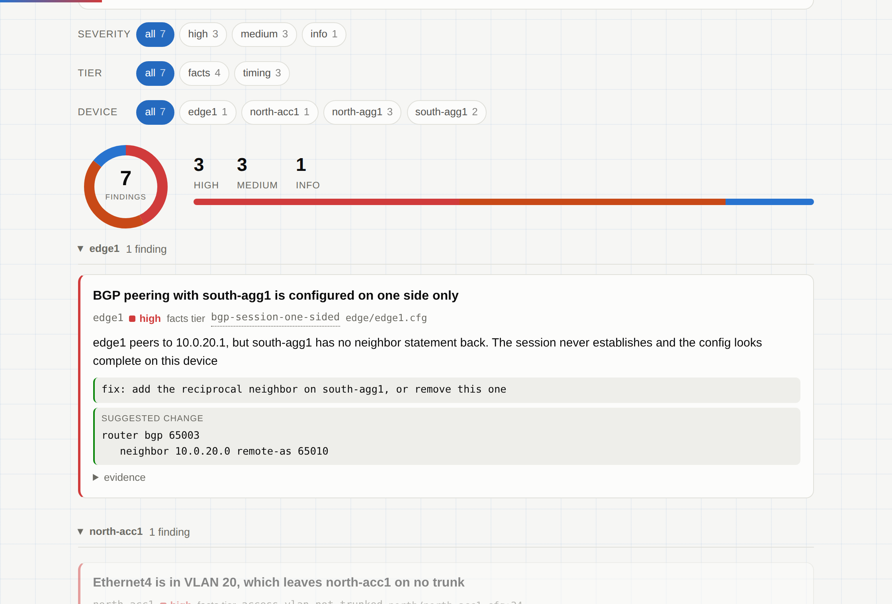
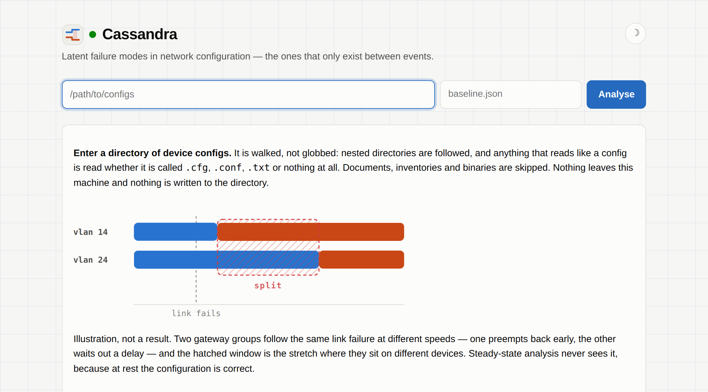
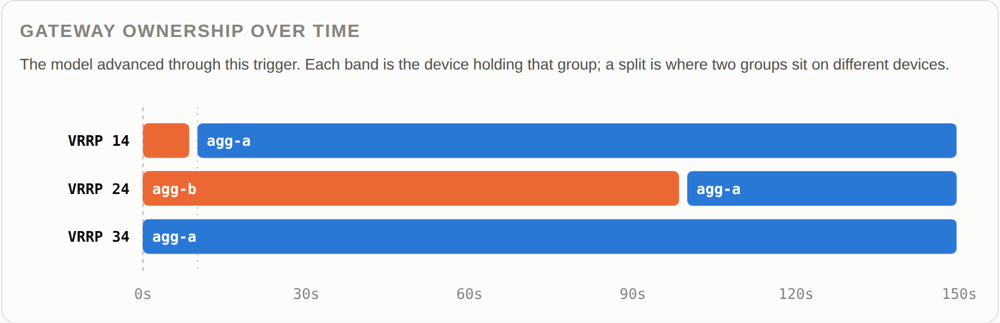

# Cassandra — network config QA

**Point it at a directory of network configs. Get back a ranked list of latent failure modes,
each with the evidence that produced it.**

Arista EOS, Cisco IOS and NX-OS, detected automatically. VRRP and HSRP. No lab, no containers,
no account, no network access.



## What it looks for

Most config checkers answer questions about the steady state: is this address duplicated, is
this VLAN declared, do these two ends agree. Those checks are here — thirty of them — and they
are worth having.

The interesting findings are the other kind: failures that no steady state contains, because
they are properties of a configuration *plus* a sequence of events *plus* the timers governing
the reaction. A pair of gateways that are correctly configured at rest and spend ninety seconds
on different devices after a link flaps is not visible to any tool that only looks at rest.



## The figure that makes the point

A timing finding says two gateway groups end up on different devices for ninety seconds. That
sentence is easy to nod at and hard to picture, so the tool draws the model's own output —
which device holds each group, second by second, under the trigger that produced the finding:



VRRP 24 sits on `agg-b` while 14 and 34 sit on `agg-a`. That gap **is** the failure. No steady
state contains it, which is why static analysis reports this network healthy — and Batfish,
run against these same configs, does exactly that.

```
$ cassandra check ./configs --explain
HIGH  agg-a  VRRP 14 and VRRP 24 can end up on different devices
        they share a device pair but respond to the same event differently, leaving
        the gateways split for about 90s
        trigger: flap agg-a:Ethernet1 1x (10s down, 20s up)
        fix: make tracking and preempt delay consistent across groups on the same pair
        rule: fhrp-divergence (timing)
```

## Setup

Requires [uv](https://docs.astral.sh/uv/). Python 3.12 is pinned in `.python-version` and
fetched automatically. Nothing else — the whole tool is the standard library.

```sh
uv sync                                        # install
uv run cassandra check ./configs               # findings, ranked; exit 1 if any
uv run cassandra check ./configs --explain     # + evidence, fixes, rule ids
uv run cassandra check ./configs --json        # machine-readable, with a config digest
uv run cassandra check ./configs --fail-on high  # print everything, block on high only
uv run cassandra facts ./configs               # the materialised fact pack
uv run cassandra facts ./configs --json        # the same, whole, for checking against
uv run cassandra rules                         # every check, and when each stays quiet
uv run cassandra rules fhrp-divergence         # one rule in full
uv run cassandra serve                         # local web view on 127.0.0.1:8765
uv run cassandra report ./configs -o out.html  # shareable standalone file

uv run cassandra check ./configs --save-baseline base.json   # record a run
uv run cassandra check ./configs --since base.json           # what changed since
uv run cassandra report ./configs --since base.json -o out.html   # the same, shareable
```

`--since` answers the question a QA tool is actually for: *did I break something?* Only new
findings fail it — the ones you already knew about were accepted when the baseline was taken.
The web view takes the same baseline: findings arrive tagged new or known, and the ones that
stopped being reported get their own section, because a finding that disappeared may be a fix
or may be a second defect masking the first.

### Pointing it at real files

`./configs` can be a tree. Discovery walks it, takes `.cfg`, `.conf`, `.txt` and extensionless
files, and decides anything ambiguous by reading the first 16 KiB and asking whether it reads
like a config. READMEs, inventories, source, images and archives are skipped; a file that
parses but yields no hostname and fewer than two interfaces is dropped rather than counted as
an empty device. Nothing is written, nothing is uploaded, and no `.cfg` is refused silently —
if a plausible file is skipped, it says so.

### The web view and the report

`serve` also answers `/rules` (every check, and when each stays quiet),
`/rules.json`, `/findings.json`, and `/report.html`, which downloads the standalone file.
Every filter is in the query string, so any state the page shows is a link you can send,
bookmark or curl.

Both are one renderer, so the file cannot drift from what the app shows. Both are entirely
self-contained: no stylesheet, script, font or image is fetched, and there is no script tag at
all — including the light/dark toggle, which is a checkbox and a stylesheet. A report you email
to someone works on a laptop with no network, and anyone can read its source.

## What to distrust

FACTS findings are decidable from the configuration. If one is wrong, it is a bug.

TIMING findings are not. They come from a discrete-event model of timer interaction, not from
running the protocols, so each one tells you a sequence your configuration *permits* — and each
one shows you the sequence so you can judge it. [docs/timing-model.md](docs/timing-model.md) is
the register of every assumption that model makes, what firmware is believed to do instead, how
confident that is, and the specific lab observation that would falsify it.

The register is not decoration. Writing it found six defects in the model, four of them
behavioural. The largest open risk is named in it: on Cisco's reading of `standby delay
minimum`, the divergence this tool was built to find would not exist on IOS at all.

**Phase 4 — validating the model against real firmware — is not done.** Supplying a cEOS image
and dispatching `validate-timing-model.yml` is what closes it.

## Documentation

**[PROJECT.md](PROJECT.md) is the spec and the source of truth.** Read it first.

- [docs/RULES.md](docs/RULES.md) — every check, generated from the rules themselves, including
  what each one deliberately does not fire on
- [docs/timing-model.md](docs/timing-model.md) — the assumption register for the TIMING tier
- [docs/CONVENTIONS.md](docs/CONVENTIONS.md) — standing rules, including how the build loop
  makes decisions
- [docs/DECISIONS.md](docs/DECISIONS.md) — the log of those decisions and current phase status
- [docs/emulation-fidelity.md](docs/emulation-fidelity.md) — why cEOS specifically

## Layout

```
cassandra/factpack/    schema, config discovery, EOS/IOS/NX-OS parsers, topology
cassandra/facts/       FACTS tier: deterministic rules
cassandra/timing/      TIMING tier: discrete-event model + sequence enumeration
cassandra/catalogue.py rule documentation, derived from the rules
cassandra/baseline.py  record a run, compare against it
cassandra/app.py       local web view (stdlib only)
cassandra/visuals.py   figures drawn from facts
cassandra/art.py       generated artwork, kept apart so it cannot be read as a result
cassandra/cli.py       facts | check | report | rules | serve
scenarios/             CI emulation validator + its configs
docs/                  spec, conventions, decisions, rules, timing model, fidelity
tests/                 the suite; run it with uv run pytest
```

Development:

```sh
uv run ruff check . && uv run ruff format --check . && uv run pytest
```

Running a scenario additionally needs Docker, Containerlab, and an imported Arista cEOS image.
That is for validating the model in CI. It is never something a user has to set up.
